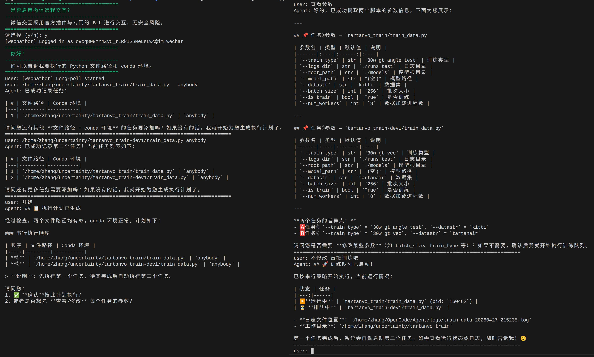
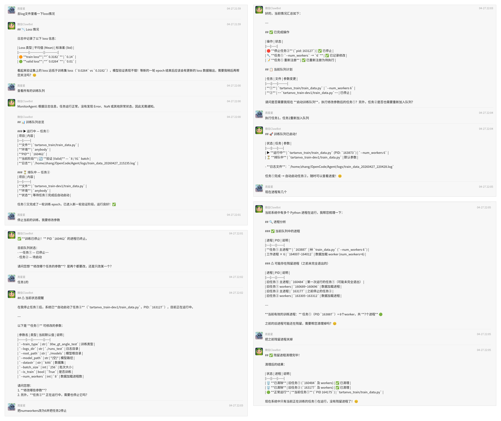

# Training Agent

一个用于管理 Python 训练任务的多 Agent 助手。项目支持通过终端或微信远程交互收集训练脚本路径和 conda 环境，生成训练计划，确认参数后启动训练，并定时监控运行日志。

## 功能

- 通过终端交互录入训练任务。
- 可选启用微信远程交互。
- 检查训练脚本路径和 conda 环境。
- 按计划执行训练脚本。
- 将训练输出写入 `logs/` 目录。
- 定时读取运行中任务的日志尾部，并交给监控 Agent 判断异常。

## 演示示例

### 终端交互与训练队列

`example1.png` 展示了终端交互流程：启用微信远程交互后，用户依次提交两个训练脚本路径和 conda 环境，Agent 自动记录任务、提取脚本参数、生成串行执行计划，并在确认后启动训练队列。



### 微信远程监控与任务调整

`example2.png` 展示了微信远程交互流程：用户可以在微信中查看 loss、查询训练队列、停止当前训练、修改任务参数、重新启动队列，并检查残留进程清理结果。




## 项目结构

```text
.
├── config.py                 # 模型 API 地址、Key 和模型名配置
├── data_storage.py           # 训练任务注册表
├── launch.py                 # 项目启动入口
├── subagents/
│   └── custom_agents.py      # 规划、参数提取、执行、监控 Agent
├── tools/
│   └── tool.py               # shell、训练执行、日志读取等工具函数
├── logs/                     # 训练日志输出目录
├── install.sh                # 安装脚本
└── README.md
```

## 环境要求

- Linux 环境。
- Python 3.10 或更新版本。
- `conda`：用于执行用户指定的训练脚本环境。
- 可访问配置的模型 API 服务。

## 安装

在项目根目录执行：

```bash
chmod +x install.sh
./install.sh
```

安装脚本会创建 `.venv` 虚拟环境，安装运行依赖，并创建 `logs/` 目录。

安装完成后进入环境：

```bash
source .venv/bin/activate
```

## 配置

运行前检查 `config.py`：

```python
BASE_URL = "https://api.deepseek.com/v1"
API_KEY = "your-api-key"
MODEL_NAME = "deepseek-v4-flash"
```

请把 `API_KEY` 改成自己的密钥。当前代码直接从 `config.py` 读取配置，没有读取环境变量。

## 启动

```bash
source .venv/bin/activate
python launch.py
```

启动后会先询问是否启用微信远程交互：

- 输入 `y`：启用微信 Bot，并同时保留终端交互。
- 输入 `n`：只使用终端交互。

## 使用方式

启动后，在终端输入训练任务信息，例如：

```text
我要执行 /path/to/train.py，conda 环境是 myenv
```

Agent 会收集所有任务、生成执行计划，并在执行前要求确认预设的参数。训练任务启动后，日志会写入：

```text
logs/<脚本名>_<时间>.log
```

运行中，Agent 会定时读取日志文件的最后部分，判断是否有异常，并在微信或终端输出监控结果。
查询运行状态或日志时，可以直接询问：

```text
现在训练状态怎么样？
```

退出终端交互：

```text
exit
```
